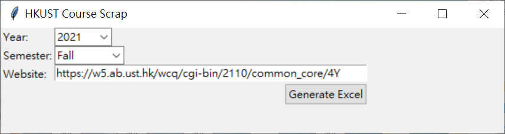

# Extract HKUST Common Core Course Offering and Enrollment Data Tool

- Written by Joseph Lam (mhlamaf@connect.ust.hk)
- Last modified: 28 April 2021

## GUI Tool Usage
1. Open `HKUST CC Scrape.exe` and you will see the following window.



2. Select the academic year from the first dropdown list. (e.g. If it is 2020-2021, select 2020) The option of the dropdown list will change according to the current year. (e.g. if today is in 2020, the options will be [2019, 2020, 2021])

3. Select the semester for the second dropdown list.

4. The URL in the bottom textbox will change according to the selection of the dropdown lists. If you want to input a custom URL, you can directly paste the URL to the textbox.

5. Click "Generate Excel" to scrape the given URL.

Note that there is a possibility that the tool fail to convert the webpage. If it happens, the tool would first try to generate an Excel file, and the parts that fail to convert are highlighted in red (e.g. `sample_output_fail.xlsx`). If it fails to generate an Excel file, the tool would report an error.

## Scraping Configuration
There are two files (`common_core_order.json` and `school_subject.json`) can be configured in any text editor. If there is any change in common core area or subject, you can modify these two file to match your need. Note that these files follow the [JSON](https://en.wikipedia.org/wiki/JSON) format. Please remember to match the JSON format while configuring, otherwise the tool cannot parse the files correctly.

If a common core course has more than one common core area, the final display order is based on the order in `common_core_order.json`. The following is the example of the file.
```json
[
    "H-SSC",
    "SA-SSC",
    "S&T-SSC",
    "QR-SSC",
    "C-Comm-SSC",
    "Arts-SSC",
    "H",
    "SA",
    "S&T",
    "QR",
    "C-Comm",
    "E-Comm",
    "Arts",
    "HLTH"
]
```
Base on the above configuration, if a course belongs to "H" and "SA-SSC", the final display order is "H + SA-SSC".

If you want to change the display order or add common core areas, you can swap the lines or add a line to the file. The format of each line is `"<common core area>"`

As the HKUST Class Schedule & Quota website does not provide which school does a subject belongs to, the `school_subject.json` helps the mapping of schools and subject. The following is the example of the file.
```json
{
    "HLTH": "DSTO",
    "ENVR": "IPO",
    "SUST": "IPO",
    "ENTR": "JS",
    "RMBI": "JS",
    "ACCT": "SBM",
    "ECON": "SBM",
    "FINA": "SBM",
    "ISOM": "SBM",
    "MARK": "SBM",
    "MGMT": "SBM",
    "BIEN": "SENG",
    "BMED": "SENG",
    "CENG": "SENG",
    "CIVL": "SENG",
    "COMP": "SENG",
    "CORE": "ALL",
    "ELEC": "SENG",
    "ENGG": "SENG",
    "IEDA": "SENG",
    "IELM": "SENG",
    "ISDN": "SENG",
    "MECH": "SENG",
    "HART": "SHSS",
    "HUMA": "SHSS",
    "LANG": "SHSS",
    "SHSS": "SHSS",
    "SOSC": "SHSS",
    "CHEM": "SSCI",
    "LIFS": "SSCI",
    "MATH": "SSCI",
    "OCES": "SSCI",
    "PHYS": "SSCI",
    "SCIE": "SSCI",
    "PPOL": "IPO"
}
```
Each line represents a subject and its school with the format `<Subject>: <School>`.

## File Description
The following files is for users:
- `User Guide.pdf`: The guide of the usage of the tool and development information.
- `HKUST CC Scrape.exe`: The GUI tool to generate Excel file from HKUST Class Schedule & Quota website.
- `common_core_order.json`: The json file to configure the display order of common core areas if a course has more than one common core area.
- `school_subject.json`: the json file to configure the mapping of course subjects and schools.
- `sample_output.xlsx`: The sample Excel file generated from `HKUST CC Scrape.exe` with course information of 2020-2021 Spring term.
- `sample_output_fail.xlsx`: The sample Excel file generated from `HKUST CC Scrape.exe` with course information of 2020-2021 Spring term as an example of fail conversion.

The following files is for developers:
- `README.md`: The editable version of `User Guide.pdf`.
- `/image`: The folder contains all images of `README.md`.
- `mainTk.py`: The main Python script with GUI.
- `course_scrap_parse.py`: The Python script that contains all the parsing logic.
- `web.ico`: The icon of the generated .exe file.
- `install.ps1`: A script for user to quickly install the required Python packages.

Some files will be automatically generated by the operating system. Please ignore any file with the prefix ".", e.g. `.DS_Store`.

## Development Documentation
### Enviroment
The tool is developed and tested in Python 3.7 and Python 3.8. It should be able to work in Python 3. Two external packages (`beautifulsoup4`(v4.8.0) and `openpyxl`(v3.0.0)) are used to parse HTML website and generate Excel file. To install the required package, run the following command:

MacOS and Linux:
```bash
pip3 install beautifulsoup4 openpyxl
```
Windows:
```bash
pip install beautifulsoup4 openpyxl
```
Ananconda:
```bash
conda install beautifulsoup4 openpyxl
```

### Program Structure
All the scraping and parsing code are located in `course_scrap_parse.py`, which has two main function:
- `formatCourse()`: Parse the HTML content of a course to dictionary. If the Class Schedule & Quota website has changed in the future, you can only change this function and return a dictionary with the same structure, then you should be able to run the program as before without changing any other codes.
- `parseCourse()`: Parse the dictionary generated from `formatCourse()` to Excel column text

` mainTk.py` is the program with GUI using Tkinker package.

### Generating .exe executable
To run the program on computer without Python installed, a standalone executable can be generated from the program. I am using `PyInstaller`(v4.0) with `auto-py-to-exe`(v2.7.8) (A GUI Tool) to generate the .exe file.

The following command is used to generate the `HKUST CC Scrape.exe`: (replace `<path to xxx>` to the correct path)
```bash
pyinstaller --noconfirm --onefile --windowed --icon "<path to web.ico>" --name "HKUST CC Scrape" --add-data "<path to common_core_order.json>;./common_core_order.json" --add-data "<path to school_subject.json>;./school_subject.json" "<path to mainTk.py>"
```

## Security Issue of the .exe File

Since the generated .exe file may be classified as malware by some anti-virus/security software, the .exe executable cannot be open in those machines. If this is the case, the following is a quick guide on how to install Python with all required packages, and use the application without the .exe file:

1. Go to Microsoft Store and search with keyword "python". Install "Python 3.8".
2. Right click on the `install.ps1` in the attached zip and click "Run with PowerShell". Wait a while for installing necessary software on top of Python. You should see some successful messages in the pop-up window.
3. If all goes well, open `mainTk.py` in the attached zip with "Python 3.8". A window will pop-up same as using the .exe executable.